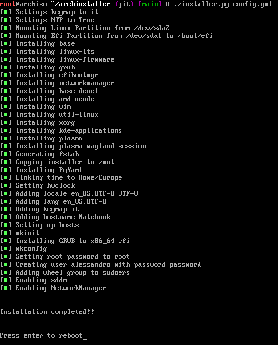

[![Contributors][contributors-shield]][contributors-url]
[![Forks][forks-shield]][forks-url]
[![Stargazers][stars-shield]][stars-url]
[![Issues][issues-shield]][issues-url]
[![MIT License][license-shield]][license-url]


<!-- PROJECT LOGO -->
<br />
<p align="center">
  <a href="https://github.com/alemazzo/ArchInstaller">
    
  </a>

  <h3 align="center">Arch-Installer</h3>

  <p align="center">
    An easy-to-use Arch-Linux installer written in Python
    <br />
    <a href="https://github.com/alemazzo/ArchInstaller"><strong>Explore the docs »</strong></a>
    <br />
    <br />
    <a href="https://github.com/alemazzo/ArchInstaller">View Demo</a>
    ·
    <a href="https://github.com/alemazzo/ArchInstaller">Report Bug</a>
    ·
    <a href="https://github.com/alemazzo/ArchInstaller">Request Feature</a>
  </p>
</p>


<!-- TABLE OF CONTENTS -->
## Table of Contents

- [Table of Contents](#table-of-contents)
- [About The Project](#about-the-project)
  - [Built With](#built-with)
- [Getting Started](#getting-started)
  - [Prerequisites](#prerequisites)
  - [Installation](#installation)
- [Configuration](#configuration)
- [Usage](#usage)
- [Roadmap](#roadmap)
- [Contributing](#contributing)
- [License](#license)
- [Contact](#contact)


<!-- ABOUT THE PROJECT -->
## About The Project
<center>

</center>

I often change operating system and I was tired of having to search every time one of the thousands of tutorials / guides on the internet on how to install arch-linux so I decided to create my own installer


For now it offers a very limited range of installation customizations, which are however sufficient to install a stable and working version of the operating system.

### Built With

* [Python3](https://www.python.org)
* [PyYAML](https://pyyaml.org)


<!-- GETTING STARTED -->
## Getting Started

The followings are the steps for install Arch with this tool.

### Prerequisites

1. Download the Arch-Linux ISO from the [official website](https://archlinux.org/download/)
2. Make a [bootable USB](https://wiki.archlinux.org/title/USB_flash_installation_medium) with the ISO
3. Boot the ISO
### Installation

1. Install git
```sh
pacman -Syy git
```
2. Clone the repo
```sh
git clone https://github.com/alemazzo/archinstaller
```
3. Change directory
```sh
cd archinstaller
```
## Configuration

1. If you want to make the partitions by yourself this is the moment. Otherwise use the `format.sh` script for erase all the disk and create a unique partition for the os.
```sh
# This will delete all your data

# Make the script executable
chmod +x format.sh 

# Execute the script
./format.sh
```
2. Start editing the configuration
```sh
nano config.yml
```
3. Manage the settings in the `accounts` section and set the root's password and the data for the base account.
```yaml
accounts:
  root-password: root
  username: alessandro
  password: password
```
4. Manage the `settings` section for your system setup.
```yaml
settings:
  ntp: true
  keymap: it
  locale: en_US.UTF-8 UTF-8
  lang: en_US.UTF-8
  region: Europe
  location: Rome
  hostname: Matebook
```
5. Manage the `packages` section (do not touch the required packages). <br>
You can add the packages that you want in your system but i suggest you to install them once the system is already installed and not during the installation.
```yaml
packages:
  # Required packages
  ...

  # Window Managment
  - xorg
  - kde-applications
  - plasma
  - plasma-wayland-session

  # You can add other stuff here

```


<!-- USAGE EXAMPLES -->
## Usage


1. Make the script executable
```sh
chmod +x installer.py
```
2.  Execute the installer
```sh
./installer.py config.yml
```


<!-- ROADMAP -->
## Roadmap

See the [open issues](https://github.com/alemazzo/ArchInstaller/issues) for a list of proposed features (and known issues).

<!-- CONTRIBUTING -->
## Contributing

Contributions are what make the open source community such an amazing place to be learn, inspire, and create. Any contributions you make are **greatly appreciated**.

1. Fork the Project
2. Create your Feature Branch (`git checkout -b feature/AmazingFeature`)
3. Commit your Changes (`git commit -m 'Add some AmazingFeature'`)
4. Push to the Branch (`git push origin feature/AmazingFeature`)
5. Open a Pull Request


<!-- LICENSE -->
## License

Distributed under the MIT License. See `LICENSE` for more information.

<!-- CONTACT -->
## Contact

Alessandro Mazzoli - [@alessandro.py](https://instagram.com/alessandro.py) - developer.alessandro.mazzoli@gmail.com

Project Link: [https://github.com/alemazzo/ArchInstaller](https://github.com/alemazzo/ArchInstaller)

<!-- MARKDOWN LINKS & IMAGES -->
<!-- https://www.markdownguide.org/basic-syntax/#reference-style-links -->
[contributors-shield]: https://img.shields.io/github/contributors/alemazzo/ArchInstaller.svg?style=flat-square
[contributors-url]: https://github.com/alemazzo/ArchInstaller/graphs/contributors
[forks-shield]: https://img.shields.io/github/forks/alemazzo/ArchInstaller.svg?style=flat-square
[forks-url]: https://github.com/alemazzo/ArchInstaller/network/members
[stars-shield]: https://img.shields.io/github/stars/alemazzo/ArchInstaller.svg?style=flat-square
[stars-url]: https://github.com/alemazzo/ArchInstaller/stargazers
[issues-shield]: https://img.shields.io/github/issues/alemazzo/ArchInstaller.svg?style=flat-square
[issues-url]: https://github.com/alemazzo/ArchInstaller/issues
[license-shield]: https://img.shields.io/github/license/alemazzo/ArchInstaller.svg?style=flat-square
[license-url]: https://github.com/alemazzo/ArchInstaller/blob/master/LICENSE.txt
[product-screenshot]: images/screenshot.png